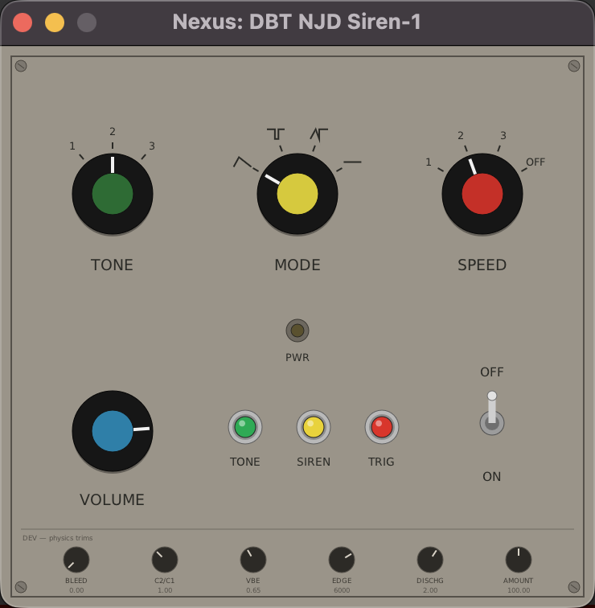

# njd-siren-dpf

NJD-style dub siren generator (DPF, VST3 + LV2) for the nexus-preamp rig.



Circuit model of the real unit (ZEN Instruments / Zack Nelson schematic redraw),
not a synth recipe:

- **Main oscillator**: two-transistor astable. Each half-period is
  `t = R*C*ln((Vm + 9 - 1.3)/(Vm - 0.65))` with its OWN modulation voltage `Vm`,
  so pitch and duty cycle move together — the pulse spectrum's moving notches
  ARE the NJD grain. `Vm < 0.65 V` stalls the oscillator: silence (this is how
  the unit goes quiet, there is no envelope anywhere).
- **LFO**: same astable (1.5/3.3/7.2 Hz from SPEED). Its square charges C5
  through D4/R22 (~0.1 s); C5 discharges through R23/R24 (`discharge` knob) —
  the shaped "uneven triangle". SPEED OFF freezes the LFO: the siren chokes at
  rest and is played with the buttons.
- **Buttons**: TRIG = S1 (fast-charge C5 + LFO reset), SIREN = S2 (slow charge
  through R25, `charge` knob — the wind-up is capacitor physics), TONE = forces
  the fixed-pitch routing (D1/D2/R8/R9, ~330 Hz at TONE 2). Rocker = S6 power,
  latched; buttons power the unit while held (release = 2 ms cut). With the
  rocker ON, releasing TRIG leaves the authentic falling discharge tail.
- **MODE** routes the sources onto the two halves: 1 wail (shaped/fixed),
  2 two-tone with stall gaps (square/fixed), 3 chaos (shaped/square), 4 fixed.
- **Output**: 2x one-pole 106 Hz HP (C9/R26, C8/R27), 6 kHz edge rounding,
  optional tanh drive. The PWR LED follows C5 (the sweep), like the real T5
  LED driver.

The plugin is a 2-in/2-out **insert**: input passes through untouched and the siren is
summed on top, so it drops anywhere in a sushi chain (before Dubwize / reverb sends).
No MIDI input — the buttons are bool params, mapped CC→param in sushi or driven
from the webapp (same pattern as Dubwize's tap button).

## Front panel (params mirror the NJD faceplate)

- **TONE** rotary 1/2/3 — osc-rate ladder S5 (470k/220k/100k): low/mid/high register
- **MODE** rotary 1/2/3/4 — S4 routing: wail / two-tone with gaps / chaos / fixed tone
- **SPEED** rotary 1/2/3/OFF — LFO ladder S3: 1.5/3.3/7.2 Hz; OFF = LFO frozen (manual play)
- **VOLUME** — output level
- **TONE** button — forces the fixed-pitch routing while held
- **SIREN** button — S2: slow C5 charge (wind-up by capacitor physics)
- **TRIG** button — S1: instant C5 slam + LFO reset; **OFF/ON rocker** — S6 latched power
- **PWR LED** — follows C5, i.e. the sweep level (`ledLevel` output param)

Fine-tune params (host/webapp only, not on the panel): `charge`, `discharge`,
`amount`, `drive`.

The optional NanoVG UI renders the faceplate one-to-one (rotary switches click to the
next detent, pushbuttons are momentary, the rocker latches).

## Build (host)

```sh
cmake -B build-host -DCMAKE_BUILD_TYPE=Release
cmake --build build-host -j8
ctest --test-dir build-host
```

Options: `-DSIREN_BUILD_UI=OFF` for a headless build (use this for the Bela
cross-build), `-DSIREN_BUILD_STANDALONE=ON` for a standalone app (UI dev;
falls back to CoreAudio/RtAudio without JACK).

## Cross-build (Bela)

Same flow as the other nexus plugins, target `Siren-vst3`:

```sh
docker run --rm -v "$(pwd):/workdir" -w /workdir/sushi-on-bela/build-arm64/njd-siren-dpf \
  elk-crossbuild-bookworm bash -c "cmake --build . --target Siren-vst3 -j4"
```

Deploy to `/usr/lib/vst3/Siren.vst3/Contents/aarch64-linux/Siren.so`.
